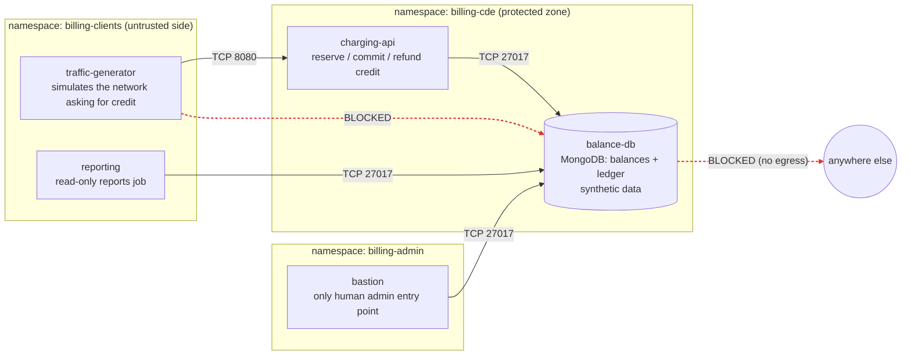

# zero-trust-charging-system

A mini prepaid **charging system** running on Kubernetes, with its balance database isolated behind default-deny network segmentation — designed to map each rule to a network-security requirement of a compliance framework (PCI-DSS Req. 1 as the primary reference).

> **Status: design only.** Nothing in this repository has been built or validated yet. Every claim below is a design intent. Sections will be updated with real evidence (manifests, test output) as each phase is completed.

## Why this project

Carrier-grade prepaid charging systems decide, in real time, whether a subscriber can use the network: they hold every balance and debit it on each request. If that database is unavailable or tampered with, service stops. That makes it a textbook "crown jewel" — the kind of asset that compliance frameworks such as PCI-DSS require to be isolated in a dedicated, tightly controlled zone.

This project simulates that pattern at small scale, using synthetic data only, to show how Kubernetes `NetworkPolicy` can enforce least-privilege access around a critical database, and — just as important — where network policy stops and other controls must take over.

## Architecture

### Components

| Component | Role |
|-----------|------|
| `charging-api` | Simplified online-charging function. Exposes reserve, commit and refund operations. The only workload that writes balances. |
| `balance-db` | MongoDB instance holding balances and a transaction ledger (synthetic data). The protected asset. |
| `traffic-generator` | Legitimate client that simulates the network requesting credit. Talks to the API only, never to the database. |
| `bastion` | The single administrative entry point to the database. |
| `reporting` | Read-only consumer (billing/reports job), included to demonstrate least privilege for a legitimate non-API consumer. |

### Design notes

- `balance-db` is a **dedicated MongoDB instance**, separate from any other MongoDB in the cluster, so policies for one system are never entangled with another.
- Each balance is a single document; debits use an atomic `findOneAndUpdate` with `$inc` guarded by `balance >= amount`, which prevents double-spend without multi-document transactions. The ledger is written as a separate document.
- All legitimate traffic to the database is TCP 27017, which keeps the rules easy to read and audit.

## Allowed flows

Inside `billing-cde`, ingress **and** egress are denied by default. Only the flows below are opened. Anything not listed is blocked.

| # | Source | Destination | Port | Purpose |
|---|--------|-------------|------|---------|
| 1 | `traffic-generator` | `charging-api` | TCP 8080 | Credit requests (business flow) |
| 2 | `charging-api` | `balance-db` | TCP 27017 | Read and debit balances |
| 3 | `reporting` | `balance-db` | TCP 27017 | Reporting queries |
| 4 | `bastion` | `balance-db` | TCP 27017 | Administration |
| 5 | `charging-api`, `balance-db` | cluster DNS | UDP/TCP 53 | Name resolution |

Explicitly blocked: any client reaching the database directly, any egress from the database (a compromised database must not be able to "call home" or move laterally), and any pod outside these flows seeing the database at all.

Rules select workloads by **labels** (workload identity), not by pod IPs, so they keep working when pods are rescheduled.

## Compliance mapping (tentative)

> The requirement numbers below are a working draft and **must be verified against the official PCI DSS v4.0 text** before this mapping is presented as final.

| Design element | Intended PCI-DSS reference |
|----------------|----------------------------|
| Default-deny ingress to the protected zone | Req. 1.3.1 |
| Default-deny egress from the protected zone | Req. 1.3.2 |
| Documented table of allowed services/ports with justification | Req. 1.2.5 |
| Separation between trusted and untrusted zones | Req. 1.4 |

A secondary reference is NIST SP 800-207 (Zero Trust Architecture).

## Limits of this approach (what network policy does *not* cover)

`NetworkPolicy` operates at L3/L4: it sees sources, destinations and ports, not intent. Some things must be enforced elsewhere:

- **Read-only access for `reporting`**: the network allows it to reach port 27017, but "read-only" is enforced by a MongoDB user with a read-only role.
- **Encryption in transit and at rest, application-level access control, and audit logging** are separate requirements and out of scope for the network layer.

This project demonstrates network segmentation around a critical database. It does not, on its own, make a system PCI-DSS compliant.

## Roadmap

- [x] Architecture and flow matrix defined
- [ ] Deploy components on a Kubernetes cluster with a CNI that enforces `NetworkPolicy`
- [ ] Apply default-deny + explicit allow policies
- [ ] Validate: legitimate flows work, everything else is blocked (with captured evidence)
- [ ] Adversarial validation (simulated compromised pod attempting lateral movement)
- [ ] Finalize the compliance mapping against the official text

## References and credits

This project builds on the work of others. Everything used or referenced is credited here.

**Standards and frameworks**

- [PCI Security Standards Council](https://www.pcisecuritystandards.org/) - PCI DSS v4.0, the compliance framework the design is mapped against (Requirement 1: network security controls).
- [NIST SP 800-207](https://csrc.nist.gov/pubs/sp/800/207/final) - Zero Trust Architecture, secondary reference.
- [RFC 4006](https://www.rfc-editor.org/rfc/rfc4006) (Diameter Credit-Control Application) and [3GPP TS 32.299](https://www.3gpp.org/DynaReport/32299.htm) (Diameter charging applications) - the real-world online charging model this project simplifies. Diameter itself is intentionally not implemented; the API is a plain HTTP simplification.

**Technology**

- [Kubernetes](https://kubernetes.io/docs/concepts/services-networking/network-policies/) - `NetworkPolicy`, the enforcement mechanism.
- [k3s](https://k3s.io/) - lightweight Kubernetes distribution (originally created by Rancher Labs, now a CNCF project).
- [Project Calico](https://www.tigera.io/project-calico/) - CNI used to enforce network policy.
- [MongoDB](https://www.mongodb.com/) - database for balances and ledger; atomic single-document updates via [`findOneAndUpdate`](https://www.mongodb.com/docs/manual/reference/method/db.collection.findOneAndUpdate/).

**Tooling**

- [Mermaid](https://mermaid.js.org/) - diagrams as code, rendered natively by GitHub.
- [Shields.io](https://shields.io/) and [Simple Icons](https://simpleicons.org/) - README badges and logos.

All trademarks belong to their respective owners. Their use here is descriptive; this project is not affiliated with or endorsed by any of them.

## Data

All data is synthetic. No real subscriber, payment or personal data is used anywhere in this project.
